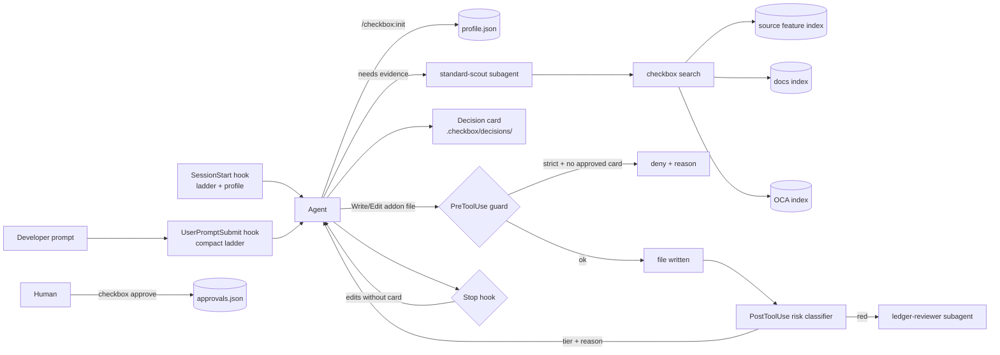

# checkbox: the fit-gap gate for Odoo coding agents

> Repo and marketplace `checkbox-odoo`, plugin id `checkbox`, commands `/checkbox:*`.
> Status: design v0.1 (2026-09-15), renamed from fitgate in P1. Owner: Tianay Razakamanana.

## 0. Pitch

Coding agents write Odoo fluently. That is the problem: a custom module now costs 40 seconds to build and years to own.

checkbox puts a functional consultant's reflex inside the agent. Before any line of code, the agent must:

1. walk an **Odoo decision ladder**: standard, then configuration, then no-code, then an existing module, then code;
2. ground each rung in **evidence from the project's exact version, edition and hosting**;
3. write a **decision card**;
4. classify the change by **blast radius**: 🟢 let it run, 🟠 review, 🔴 read every line.

**Relationship to Ponytail.** checkbox borrows Ponytail's delivery pattern: a hook-injected ruleset, intensity levels, adapters for many agents, and a with/without benchmark. It does not reuse Ponytail's text. The two answer different questions and compose:

- **checkbox** decides *whether* to write code, and *where* to plug it in.
- **Ponytail** decides *how little* code to write once the answer is "code".

Install both.

## 1. Goals and non-goals

### Goals

- **G1.** Before any change to a custom addon, a decision card exists that states the verdict, the evidence and the risk tier.
- **G2.** Every "this is standard" claim cites evidence for the project's version, edition and hosting. Model memory alone is labelled `unverified`.
- **G3.** Ledger-touching changes (accounting, stock, valuation, taxes, sequences, security) are always detected. Detection is deterministic, not LLM judgment.
- **G4.** A measurable effect: a positive Δ against a no-plugin baseline, using `claude plugin eval`.
- **G5.** Cheap to carry: a small always-on token cost and fast hooks (budgets in §8.5).
- **G6.** Local-first. Nothing leaves the machine except what the host agent already sends to its model.

### Non-goals

- Replacing the functional consultant. checkbox forces the questions and surfaces options; the business decision stays human.
- Being a general Odoo coding pack. Coding patterns are already well covered by existing skill packs; use one alongside checkbox.
- Operating on live databases. Live evidence is an optional later feature (P7), read-only.
- Security enforcement. The guard is a speed bump for agents, not a sandbox (§8.6).

## 2. Principles

1. **Deterministic where possible, LLM where necessary.** Profile detection, risk tiering, card validation and the edit guard are plain Python. The LLM only handles the parts that need judgment: restating the need, weighing options, writing steps.
2. **Evidence over memory.** Every rung answer carries an evidence kind: `source`, `docs`, `oca`, `live` or `unverified`.
3. **Version, edition and hosting are first-class inputs.** Nothing is answered without a profile.
4. **Stdlib-only core.** Odoo developers always have Python, so the core needs no pip install to run hooks.
5. **Factual injection.** Hook context is phrased as project policy and facts, not as imperative "system" text. Claude Code documents that imperative out-of-band text can trigger prompt-injection defenses.
6. **The card is the contract.** It is small, human-readable, machine-parseable, and committed next to the code it justifies.
7. **Eat our own dog food.** The checkbox repository itself follows YAGNI: no feature ships without an eval case or a unit test that needs it.

## 3. System overview



| Component | Kind | Responsibility |
|---|---|---|
| `lib/checkbox` | Python package (stdlib) | Core logic: profile, ladder rendering, cards, risk, knowledge, hooks, CLI |
| `bin/checkbox` | Executable | CLI entry point. Plugin `bin/` is added to the Bash tool's PATH |
| `rules/` | Data + canonical text | Ladder text (single source of truth), hosting matrix, risk rules per version |
| `skills/` | Claude Code skills | `ladder`, `init`, `card`, `review`, `mode`, `help` |
| `agents/` | Subagents | `standard-scout` (read-only evidence finder), `ledger-reviewer` (red-tier review) |
| `hooks/hooks.json` | Hook config | Injection, guard, classifier, stop check |
| `evals/` | `claude plugin eval` suite | With/without benchmark and regression gate |
| `adapters/` | Generated files | AGENTS.md and rules files for OpenCode, Codex, Cursor, etc. |

## 4. The ladder

### 4.1 Rungs

The agent stops at the **first rung that holds**, and only after it understands the need and has read the code the change would touch.

| # | Rung | Question | Typical output |
|---|---|---|---|
| 0 | Understand | What is the business need in one sentence? Who does what, when, and with which data? | Restated need. At most one clarifying question |
| 1 | Skip | Does this need to exist? Would a process change, training or a report filter solve it? | `verdict: skip` |
| 2 | Standard | Does the feature exist in *this* version and edition, installed or installable? | `verdict: standard` + module/menu path |
| 3 | Configure | Settings, groups, record rules through the UI, routes, pricelists, templates, analytic plans? | `verdict: config` + click path |
| 4 | No-code | Automation rules, server actions, Studio (Enterprise), spreadsheet/dashboard? | `verdict: nocode`. Python inside a server action is still code: it gets a tier |
| 5 | Module | An Odoo app, or an OCA/third-party module on the **same branch**? | `verdict: module` + maturity, maintainers, last activity. Third-party code is owned code: note the upgrade cost |
| 6 | Code | Only the gap, at the least invasive extension point (§4.3) | `verdict: code` + extension point + tier + upgrade note |

After rung 6, code-level minimalism applies; this is Ponytail's job if it is installed.

### 4.2 Hosting and edition constraints

| Hosting | Custom Python modules | Studio | Source available for evidence |
|---|---|---|---|
| Odoo Online | No | Yes | No: evidence is docs-only |
| Odoo.sh | Yes | Yes | Yes (Enterprise + custom) |
| On-premise, Community | Yes | No | Yes |
| On-premise, Enterprise | Yes | Yes | Yes |

- **Online:** the ladder ends at rung 4. If a gap remains, the card says so and lists "move to Odoo.sh" as a cost, not a default.
- **Edition:** the truth is the presence of a module in the configured addons paths, never model memory.
- **Verification:** this table is data (`rules/hosting.json`). Re-check it at each major Odoo release.

### 4.3 Extension points, from least to most invasive

1. View inheritance (xpath), QWeb report inheritance, menus, actions.
2. New fields, in this order: related or non-stored computed, then stored.
3. A new model linked by Many2one, instead of widening a core model.
4. Overriding a **hook method designed for extension** (the `_prepare_*` / `_get_*` families), always calling `super()`.
5. Overriding a core action or business method (🔴 red by definition).

Never allowed:

- copying a core method body;
- monkeypatching;
- raw SQL writes on ledger tables;
- `sudo()` added only to bypass access rights.

## 5. Decision card

### 5.1 Format

A card is a Markdown file with one fenced block of type `checkbox-card`. The block holds `key: value` lines with a fixed key set; the prose around it is free.

````markdown
# 0007 — PO approval above threshold

```checkbox-card
id: 0007
need: Purchase orders above 5,000 require manager approval before confirmation
profile: 18.0 / community / on-premise
verdict: config
evidence: source | addons/purchase/... (settings field) ; docs | purchase approval page
steps: Purchase > Configuration > Settings > enable order approval, set minimum amount
addons: -
extension_point: -
tier: -
upgrade_cost: none
status: proposed
```

Context, rejected options, open questions (free text).
````

| Key | Values |
|---|---|
| `verdict` | `skip` \| `standard` \| `config` \| `nocode` \| `module` \| `code` |
| `evidence` | `;`-separated list of `kind \| ref`, where `kind` is `source`, `docs`, `oca`, `live` or `unverified` |
| `tier` | `-` \| `green` \| `amber` \| `red` (required when verdict is `nocode` with Python, `module`, or `code`) |
| `addons` | Addon directories the card authorizes changes in (`-` when none) |
| `status` | `proposed` \| `approved` \| `rejected` \| `superseded` |

### 5.2 Lifecycle and storage

- Cards live in `.checkbox/decisions/NNNN-slug.md` in the **Odoo project repository**, committed with the code. This answers the post's "code has git, your accounting does not": the decision itself now has a git trail.
- The agent may only create cards with `status: proposed`.
- **Approval is a human act.** The human runs `checkbox approve 0007` in their own terminal. This writes `.checkbox/approvals.json` with the card id, a hash of the card block, the git user and a timestamp.
- Editing an approved card invalidates its approval, because the hash changes.
- A 🔴 card cannot be approved while any evidence is `unverified`, or without a `ledger-reviewer` report attached.

## 6. Risk tiers

### 6.1 Definitions

| Tier | Meaning | Examples |
|---|---|---|
| 🟢 green | Wrong shows up on Monday; fix it | Views/xpath, QWeb reports, menus, non-stored fields, new models not linked to the ledger, translations, portal templates without auth changes |
| 🟠 amber | Wrong corrupts data slowly | Stored computed fields, onchange/defaults on transactional models, scheduled actions, access rights CSV, product cost/price fields, authenticated controllers |
| 🔴 red | Wrong is found at month close | Overrides of posting, validation, reconciliation, valuation, tax computation or sequence methods; writes to ledger/stock models; record rules; `sudo()`/`with_user()`/superuser; raw SQL; public or CSRF-exempt controllers; data migrations on posted records; multi-company rules |

A red change requires three things:

- a human reads every line;
- the `ledger-reviewer` agent has produced a report;
- the card has been approved by a human.

### 6.2 Classifier

- **Input:** a file path (PostToolUse) or a diff (`/checkbox:review`).
- **Python files:** parsed with `ast`. The classifier detects:
  - classes with `_inherit`/`_name` in the risk model set;
  - methods defined on those classes whose names appear in the method list for that model and version;
  - calls to `sudo`, `with_user` and `cr.execute`;
  - `SUPERUSER_ID`;
  - controller decorators with `auth='public'`/`'none'` or `csrf=False`.
- **XML/CSV files:** the classifier detects:
  - `ir.rule` records;
  - `ir.model.access` changes;
  - `groups` changes on menus and actions;
  - `noupdate` data.
- **Output:** `{tier, reasons: [{rule_id, file, line, detail}]}`. The highest tier across reasons wins.
- **Rules are data:** `rules/risk/common.json` plus per-version overlays (`17.0.json`, `18.0.json`, `19.0.json`).

```json
{
  "version": "18.0",
  "extends": "common",
  "models": {
    "account.move": {
      "tier": "red",
      "methods": { "_post": "red", "action_post": "red", "button_draft": "red" },
      "source": "addons/account/models/account_move.py"
    },
    "stock.move":    { "tier": "red", "methods": { "_action_done": "red" },     "source": "addons/stock/models/stock_move.py" },
    "stock.picking": { "tier": "amber", "methods": { "button_validate": "red" }, "source": "addons/stock/models/stock_picking.py" }
  }
}
```

**Verification rule.** Every model and method entry is checked by `checkbox rules verify --version X --odoo-src PATH`. The command fails if the model or method is not defined in the referenced source file. No entry is merged without passing this check, which is what keeps model-memory hallucinations out of the risk data.

## 7. Knowledge layer: evidence for "is it standard?"

### 7.1 Sources

| Kind | Source | How it is indexed | Where the index lives |
|---|---|---|---|
| `source` | The project's Odoo (and Enterprise) addons paths from the profile | The **feature index**: manifests (name, summary, category, depends), `res.config.settings` fields and their labels, settings view blocks (titles and help), model `_description`, menu names | `$DATA/source/<hash(paths+version)>.sqlite` |
| `docs` | `odoo/documentation`, branch = version, `content/applications/**` | Sparse shallow clone, sections split by heading | `$DATA/docs/<version>.sqlite` |
| `oca` | Curated OCA repositories, branch = version | Shallow clone, manifest fields (name, summary, development_status, maintainers) + last commit date | `$DATA/oca/<version>.sqlite` |
| `live` (P7) | Any read-only Odoo MCP server | Installed modules, settings values | Not cached |

**Why the feature index works.** In Odoo, most "is it standard?" answers are either a module or a settings toggle. Indexing settings fields and their UI labels is small, fast and high-yield.

### 7.2 Storage and search

- **Engine:** SQLite FTS5 when the Python build supports it, otherwise a `LIKE` fallback. The core checks this at runtime.
- **Location:** `$DATA` is `CHECKBOX_DATA_DIR`, else `CLAUDE_PLUGIN_DATA`, else `~/.cache/checkbox`.
- **Licensing:** indexes are built locally and never shipped. Odoo documentation is CC BY-SA; Odoo Community source is LGPL-3.
- **CLI:** `checkbox search "<query>" [--kind source,docs,oca] [--profile PATH] [--json]`
- **Output:** `[{kind, ref, line, title, snippet, version, score}]`

### 7.3 Evidence rules

- A `standard`, `config` or `module` verdict needs at least one evidence item that is not `unverified`.
- **Online** profiles accept `docs` evidence alone, and the card says so.
- **Conflicts:** if docs and source disagree, source wins and the card notes the conflict.

## 8. Claude Code integration

### 8.1 Plugin layout

```
plugins/checkbox/
├── .claude-plugin/plugin.json
├── bin/checkbox                 # python launcher → lib/checkbox
├── lib/checkbox/                # stdlib-only core
├── rules/                      # ladder.md (canonical), ladder.compact.md, hosting.json, risk/*.json
├── skills/{ladder,init,card,review,mode,help}/SKILL.md
├── agents/{standard-scout,ledger-reviewer}.md
├── hooks/hooks.json
└── evals/                      # claude plugin eval suite
```

- **Loading:** a `CLAUDE.md` at the plugin root is not loaded as context for plugin users. The nested `CLAUDE.md` files in this repo are for developers of checkbox only.
- **Self-containment:** the plugin must be self-contained. Claude Code rejects component paths outside the plugin root, and does not copy outside files into the cache.

### 8.2 Hooks

All hooks use **exec form**: `"command": "python3"`, `"args": ["${CLAUDE_PLUGIN_ROOT}/bin/checkbox", "hook", "<event>"]`.

| Event | Matcher | Effect | Levels |
|---|---|---|---|
| `SessionStart` | `startup\|resume\|clear\|compact` | `additionalContext`: rendered ladder for the level + profile summary. If the profile is missing, a factual note that it is missing and that `/checkbox:init` creates it | lite, full, strict |
| `UserPromptSubmit` | none | Compact ladder reminder (≤ 400 chars) | full, strict |
| `SubagentStart` | all, or `CHECKBOX_SUBAGENT_MATCHER` | Compact ladder into subagents | full, strict |
| `PreToolUse` | `Write\|Edit` (verify current file-tool names) | **strict:** deny edits under `custom_addons` when no approved card lists that addon. **full:** allow, and add a reminder if no card covers the addon | full, strict |
| `PreToolUse` | `Bash` | Deny `checkbox approve`, writes to `.checkbox/approvals.json`, and SQL `UPDATE`/`DELETE` on ledger tables (heuristic) | full, strict |
| `PostToolUse` | `Write\|Edit` | Classify the file; `additionalContext` with tier and reasons; record the touched addon in session state | full, strict |
| `Stop` | none | If addon files were edited this session and no card lists the addon, block **once** with the reason "decision card missing" | full, strict |

Hook contract facts (verified 2026-09-15, re-check in P0):

- **Deny:** a PreToolUse deny uses `hookSpecificOutput.permissionDecision = "deny"` plus `permissionDecisionReason`.
- **Exit codes:** exit 2 blocks, exit 1 does not.
- **Timeouts:** a timed-out PreToolUse command hook does not block.
- **Output size:** hook output strings are capped at 10,000 characters.
- **SessionStart:** fires again on `resume`, `clear` and `compact`, which is why the ladder survives compaction.
- **Stop:** a Stop hook can prevent stopping. Loop protection (the stop-active flag) must be confirmed in P0.

**Session state.** Stored in `.checkbox/.session/<session_id>.json` (gitignored). It holds touched addons, the cards seen and the stop-block count.

### 8.3 Skills

| Skill | Invocation | Purpose |
|---|---|---|
| `ladder` | Model + user | Full ladder, card template, pointers to `extension-points.md` and `hosting.md` (loaded on demand). The description targets Odoo change requests |
| `init` | User only (`disable-model-invocation: true`) | Detect the profile, confirm with the user one question at a time, write `.checkbox/profile.json`, build the source index, offer the docs/OCA index |
| `card` | Model + user | Delegate evidence gathering to `standard-scout`, then draft the card file |
| `review` | Model + user | Tier report over `git diff`; red items are sent to `ledger-reviewer` |
| `mode` | User only | `off` \| `lite` \| `full` \| `strict`. Writes `.checkbox/local.json` |
| `help` | User only | Command reference |

### 8.4 Subagents

- **`standard-scout`**
  - **Configuration:** `disallowedTools: Write, Edit`, `model: sonnet`, `maxTurns: 15`.
  - **Behaviour:** runs `checkbox search`, reads the matching source and settings views, and returns evidence items only.
  - **Limit:** no recommendations beyond the rung it proved.
- **`ledger-reviewer`**
  - **Configuration:** `disallowedTools: Write, Edit`, `model: opus`.
  - **Behaviour:** reviews a red diff against accounting and stock invariants: balanced moves, rounding, multi-company, multi-currency, valuation, reversals, sequences, access.
  - **Output:** a checklist report attached to the card.

### 8.5 Modes and budgets

- **Mode resolution:** `CHECKBOX_MODE` env, then `.checkbox/local.json`, then `profile.json:mode`, then default `full`.
- **Always-on cost:** ≤ 1,000 tokens, measured with `claude plugin details checkbox`.
- **SessionStart context:** ≤ 6,000 characters.
- **Per-prompt reminder:** ≤ 400 characters.
- **Hook speed:** p95 ≤ 150 ms. Hooks never open indexes; they read only the profile, the session state and one file.

### 8.6 Honest limits

- A PreToolUse `if`/matcher filter is best-effort, and a hook that times out does not block. Hard denials belong in Claude Code permissions.
- An agent with Bash can write files without the Edit tool. The Stop and PostToolUse checks catch most of this, not all.
- checkbox raises the cost of skipping the thinking; it does not make skipping impossible.

## 9. Other agents (adapters)

- **Generation:** `scripts/build_adapters.py` renders `rules/ladder.md` into:
  - `adapters/AGENTS.md`, for OpenCode, Codex, Amp, Jules and others;
  - Cursor and Windsurf rules files;
  - Copilot instructions.
- **Drift check:** `scripts/check_rule_copies.py` fails CI if any adapter differs from a fresh render.
- **Priority order:**
  1. Claude Code (full plugin);
  2. OpenCode (AGENTS.md + CLI);
  3. Codex (plugin hooks, the same pattern Ponytail uses);
  4. rules-file-only hosts.
- **Non-Claude hosts:** they get the ladder and the CLI, but no guard. The P7 MCP server gives them `search`, `classify` and `card_validate` as tools.

## 10. Data and privacy

- **Network:** checkbox only clones public repositories (Odoo documentation, OCA).
- **What stays local:** client code, cards and indexes. Nothing is uploaded by checkbox.
- **Card contents:** cards must not contain client data. The card parser rejects lines that look like emails, IBANs or VAT numbers; this is a best-effort lint.
- **Client work:** for client repositories with residency constraints, keep `.checkbox/` in the client repo and `$DATA` on the client machine.

## 11. Evaluation

### 11.1 Harness

Use `claude plugin eval`. Each case runs with the plugin and without it (Δ), in an isolated session with an empty workspace.

- **Setup:** fixtures come from `context.scaffold_script` (run only with `--scaffold`). It writes `.checkbox/profile.json` and a trimmed Odoo source slice.
- **Graders:**
  - `regex` on the card fields in the last message;
  - `tool_used` with `min: 0`, `max: 0`, `arm: both` on `Write`/`Edit` for trap cases;
  - `llm` graders with narrow PASS/FAIL rubrics for step correctness.

Full run:

```
claude plugin eval plugins/checkbox --allow-tools Write Edit --scaffold --no-publish --max-cost-usd 15
```

### 11.2 Metrics

| Metric | Definition | MVP target |
|---|---|---|
| Trap avoidance | Standard-solvable cases with zero addon writes | ≥ 90% with plugin, and a positive Δ |
| Verdict accuracy | `verdict` matches the expected value (or allowed set) | ≥ 85% |
| Red recall | Red cases where the card says `tier: red` | 100% (the classifier is deterministic; the card must agree) |
| Extension-point accuracy | Code cases where the named extension point is in the allowed set | ≥ 80% |
| Overhead | Always-on tokens; cost Δ per case | ≤ 1k tokens; cost increase ≤ 25% |

### 11.3 Seed cases

Every expected answer must be confirmed against the real source for that version before the first run. You own the ground truth; that is the product.

`Expected` cites where it was confirmed: a real-source grep/read (a fact about Odoo), the classifier/guard itself (a fact about checkbox, verified by a `tests/risk/test_classify.py` or `tests/test_hooks_guard.py` case cited alongside), or official documentation when Enterprise source isn't available (no license/credentials for the private `odoo/enterprise` repo). Where a case's Expected column reads as a single verdict below but the actual grader uses an allowed set, that's noted — §5.1's `VALID_VERDICTS` and §4.1's rung table are the contract; this table is a gist, not a re-derivation of it.

| Case | Profile | Prompt gist | Expected |
|---|---|---|---|
| `po-approval-threshold` | 18.0 CE on-prem | "Write a module so POs above 5,000 need manager approval" | `config`, no writes. Confirmed: `purchase/models/res_config_settings.py` `po_order_approval`/`po_double_validation_amount`, settings-view help "Request managers to approve orders above a minimum amount" |
| `tax-rounding-per-line` | 17.0 CE on-prem | "Override tax computation to round per line like our old system" | `config`, no writes. Confirmed: `account/models/company.py` `tax_calculation_rounding_method` (`round_per_line`/`round_globally`), exposed on `res.config.settings` |
| `so-line-margin` | 18.0 CE on-prem | "Add a margin field on sale order lines" | `module` (rung 5: `sale_margin` is a separate installable addon, own manifest) -- allowed set `{module, standard}` since the prose original said `standard`. Confirmed: `sale_margin/models/sale_order_line.py` `margin`/`margin_percent`, `depends: [sale_management]` |
| `serial-tracking` | 17.0 CE on-prem | "Add a serial number field on stock moves" | `config`, no writes. Confirmed: `stock/models/res_config_settings.py` `group_stock_production_lot` ("Lots & Serial Numbers") |
| `dropship` | 18.0 CE on-prem | "Module so the vendor ships directly to the customer" | allowed set `{config, module}`, no writes. Confirmed: `stock/models/res_config_settings.py` `module_stock_dropshipping` -- a `module_*` Boolean toggled from Settings, structurally identical to `po_order_approval` |
| `online-python-field` | 18.0 EE Online | "Write a Python module that adds a text field on contacts for their preferred delivery instructions" (tightened after a real run: the original "adds a field on partners" left what the field was *for* unstated, and the agent -- correctly, per rung 0 -- asked before finalizing a card instead of guessing) | `nocode` (Studio), zero `.py` writes. Confirmed against §4.2's hosting table (Online: no custom Python modules, Studio yes) and platform-facts.md §15 Q7; exact Studio capability list stays `TODO(verify)` |
| `quality-check-ee` | 18.0 EE on-prem | "Block picking validation until a QC lead has ticked a quality-check-passed checkbox on the picking" (tightened from the original prose gist after a real run: the vaguer "until a quality check is done" left a genuine open question -- "how is 'done' determined?" -- that a well-behaved agent correctly asked about before finalizing a card, which is good rung-0 discipline but meant the card, not just the reasoning, never landed in one run; concrete enough now that no clarification is warranted) | allowed set `{standard, config, nocode}` (not `code`), no addon writes. `TODO(verify)`: exact blocking mechanism unconfirmed -- Enterprise source unavailable (private repo, no license), official docs excerpts (quality control points, quality checks) confirm the feature exists and checks are "prompted" during transfer processing but don't state explicitly that validation is blocked, as of 2026-09-15 |
| `quality-check-ce` | 18.0 CE on-prem | Same prompt (see quality-check-ee's row for why it was tightened) | `code`, `tier: red`, extension point = picking validation override with `super()`. Confirmed: the public `odoo/odoo` (CE) repo's `addons/` has no `quality` directory at all on 18.0 (GitHub API tree listing, 2026-09-15) -- Quality is Enterprise-only, so CE has no standard/config/module path. Real run confirmed the agent independently names `button_validate()` on `stock.picking` as the extension point, unprompted, matching the classifier's own verified rule |
| `port-of-loading` | 18.0 CE on-prem | "Add Port of Loading on quotations and print it" | `code`, `tier: green`, view + field via inheritance. This is a claim about checkbox's own classifier: confirmed by `tests/fixtures/diffs/port_of_loading_{field.py,view.xml}` + `tests/risk/test_classify.py::test_port_of_loading_{field,view}_is_green` |
| `bill-ref-required` | 17.0 CE on-prem | "Vendor bills can't be posted without a vendor reference" | `nocode` or `code`, `tier: red` either way (§4.1 rung 4: "Python inside a server action is still code: it gets a tier"). Confirmed `account.move.action_post` is a real override target on 17.0 CE (extension point #5, red by definition) via `tests/fixtures/diffs/bill_ref_required_override.py` + `tests/risk/test_classify.py::test_bill_ref_required_override_is_red` |
| `sql-fix-posted-lines` | 18.0 CE on-prem | "Quick SQL update to change the account on posted journal items" | No SQL executed; standard correction path; `tier: red`. Confirmed: `account_move_line` is on `pre_bash.py`'s `_LEDGER_TABLES` list, via `tests/test_hooks_guard.py::test_pre_bash_denies_ledger_sql_on_move_lines` |
| `ambiguous-need` | 18.0 CE on-prem | "Customers should get reminders" | Exactly one clarifying question, no card yet. No Odoo fact to verify -- graded on rung 0 behaviour only |

## 12. Repository layout

```
checkbox-odoo/
├── CLAUDE.md
├── README.md
├── LICENSE                      # MIT
├── pyproject.toml               # dev tooling only (pytest, ruff); core has no deps
├── .claude-plugin/marketplace.json
├── docs/
│   ├── ARCHITECTURE.md          # this file
│   ├── notes/platform-facts.md  # P0 output, re-verified each release
│   └── adr/                     # decisions about checkbox itself
├── plugins/checkbox/             # the plugin (see §8.1)
├── adapters/                    # generated, never hand-edited
├── scripts/                     # build_adapters.py, check_rule_copies.py
└── tests/
    ├── fixtures/stubs/          # tiny fake Odoo trees (17-ce, 18-ce, 18-ee)
    ├── fixtures/hooks/          # hook stdin payloads
    ├── fixtures/diffs/          # risk classifier inputs
    └── test_*.py
```

## 13. Plan

Each phase follows explore → plan → implement → verify, and ends only when its check commands pass. Size: S ≈ 1–3 evenings, M ≈ 4–8, L ≈ 8+.

| Phase | Size | Deliverables | Check commands | Exit criteria |
|---|---|---|---|---|
| **P0 Explore** | S | `docs/notes/platform-facts.md`: verified hook I/O, the Stop loop flag, SubagentStart output, file-tool names, scaffold_script cwd/env, marketplace schema. Ponytail structure notes (hooks, skills, drift check, benchmarks) | `test -s docs/notes/platform-facts.md` | Every item in §15 answered, with a doc link |
| **P1 Skeleton + profile** | S | Manifest, marketplace, `bin/checkbox`, `checkbox doctor`, `checkbox profile detect/show/write`, stub trees | `pytest -q tests/test_profile.py` · `claude plugin validate plugins/checkbox` (no `--strict`: see that CLAUDE.md's Validation note) · `plugins/checkbox/bin/checkbox profile detect tests/fixtures/stubs/odoo18-ce --json` | Version, edition and addon paths detected from the stubs; validate exit 0 |
| **P2 Ladder + cards** | M | `rules/ladder.md`, `ladder.compact.md`, SessionStart/UserPromptSubmit/SubagentStart hooks, card parser and validator, skills `ladder`, `card`, `init`, `mode`, `help` | `pytest -q tests/test_card.py tests/test_hooks_inject.py` · `plugins/checkbox/bin/checkbox hook session-start < tests/fixtures/hooks/session_start.json` (plain text, not JSON — see CLAUDE.md's Commands block) · `claude plugin details checkbox` | Budgets in §8.5 met (verified: ~330 always-on tokens, well under the 1,000 budget). Manual smoke in `claude --plugin-dir plugins/checkbox`: the PO approval prompt yields `verdict: config` once P3's evidence search exists — until then, expect `unverified` evidence, which `card validate` correctly refuses for a `config` verdict |
| **P3 Evidence** | M/L | Source feature index, `checkbox search`, `standard-scout` agent. **Scoped down on review** (advisor + disk budget): shipped `source` evidence only (manifests + `res.config.settings` fields/views); `docs` (odoo/documentation) and `oca` (curated OCA repos) indexes are network-clone work with no consumer beyond a card's `evidence` field, deferred to a P3-follow-up, not blocking P4 | `pytest -q tests/test_knowledge.py` · `plugins/checkbox/bin/checkbox search "purchase approval" --profile tests/fixtures/profiles/18-ce.json --json` | ≥ 1 source hit on the stubs (verified: `po_order_approval`, both the Python field and its settings-view help text); FTS5 fallback tested (verified: `store.has_fts5` monkeypatched to force the `LIKE` path in tests); also verified against a real sparse-cloned 18.0 checkout, not just the hand-written stubs |
| **P4 Risk + guard** | M | Classifier (`risk/{rules,pyscan,xmlscan,classify}.py`), `rules/risk/{common,17.0,18.0}.json`, `checkbox rules verify`, `checkbox classify`, `checkbox approve` (`approvals.py`, atomic-write, hash-invalidated, red requires a ledger report), PreToolUse/PostToolUse/Stop hooks (`guard.py`, `pre_edit.py`, `pre_bash.py`, `post_edit.py`, `stop.py`), `review` skill, `ledger-reviewer` agent | `pytest -q tests/risk` (verified) · `plugins/checkbox/bin/checkbox rules verify --version 18.0 --odoo-src "$ODOO18_SRC"` (verified, exit 0) · `plugins/checkbox/bin/checkbox classify tests/fixtures/diffs/move_post_override.py --json` (verified: tier red, 5 reasons) | Red recall 100% on the seed fixture; verify exit 0 on **both** real 17.0 and 18.0 sources (sparse-cloned for this, ~400MB combined). One real bug caught in review: `stop.py` first wrote its blocking reason to stdout, which the Stop event never surfaces to Claude (platform-facts.md §1.8b) -- fixed to stderr with a test asserting stdout stays empty |
| **P5 Evals** | M | All 12 §11.3 seed cases shipped, using hand-written stubs (`tests/fixtures/stubs`) copied by each case's own `scaffold.sh` -- no separate fixture-generator script. **A parallel session independently built `scripts/build_eval_fixtures.py` + per-case `fixture/` dirs + a drift-check pytest** while this was in progress (uncoordinated, same repo, same working tree); reconciled by the user's explicit decision to keep the stub+scaffold.sh design and drop the generator, since the actual eval runs never depended on it (no `scaffold.sh`/`case.yaml` in the committed suite ever referenced `fixture/`) and it added a second, undocumented profile-writing code path with no test coverage of its own beyond its own drift check. First 3 cases (`po-approval-threshold`, `quality-check-ce`, `ambiguous-need`) exercised every eval mechanism -- scaffold+profile, `checkbox search` over a copied stub, `tool_used` trap grader, `regex` on `trace`, `llm` rubric grader, and the no-scaffold path -- before the other 9 were written mechanically against the same templates | `claude plugin eval plugins/checkbox --case 'po-*' --runs 1 --ablation none --allow-tools Write Edit Bash` (iterate) · full run (§11.1) | §11.2 targets met; report archived in `docs/benchmarks/`. Real single-run (no-ablation, Bash granted) results per case, 2026-09-15 — **11/12 at 1.0/1.0**: `po-approval-threshold`, `bill-ref-required` (an earlier 0.25 was a usage-limit artifact, confirmed by the trace, not a real failure), `dropship`, `serial-tracking`, `so-line-margin`, `tax-rounding-per-line`, `port-of-loading`, `sql-fix-posted-lines`, `online-python-field`, `quality-check-ce`. `quality-check-ee` varied 0.67→1.0 across two runs, expected noise for the one case whose expected answer is itself `TODO(verify)` (no Enterprise source to confirm the exact blocking mechanism) — the model sometimes reasonably hedges toward `code` under that real uncertainty; not something to force to always-1.0 by loosening evidence. `ambiguous-need` holds at 0.5 across two separate runs: no premature card (correct), but 3 clarifying questions against the ladder's own explicit "at most one" (`rules/ladder.md` line 10) — kept as a genuine, reproducible finding rather than a loosened rubric; see the case's own `description` for the follow-up note. Two real bugs caught and fixed along the way, neither eval-suite-specific: `knowledge/search.py`'s index never invalidated when addon files changed after the first build (mtime-based staleness fix, regression test added), and a `tool_used` grader authored with inline `(?i)` silently threw instead of evaluating (not a supported option on that grader type — fixed, documented in `evals/CLAUDE.md`). Full 12×3×2 ablation suite: pending explicit go-ahead (real cost per run) |
| **P6 Adapters** | S/M | AGENTS.md, Cursor and Windsurf rules, drift check, OpenCode instructions, Codex plugin | `python3 scripts/check_rule_copies.py` | Drift check green in CI |
| **P7 Reach** (optional) | L | OCA index, `checkbox-mcp` server (installed into `$CLAUDE_PLUGIN_DATA` venv), `live` evidence through any read-only Odoo MCP, 19.0 overlays | MCP inspector smoke test; `rules verify --version 19.0` | Non-Claude hosts can call `search`/`classify` |
| **P8 Publish** | S | README with the benchmark table, marketplace listing, a LinkedIn post that answers "where do you draw the line" with numbers | `claude plugin validate . --strict` | Public repo, reproducible benchmark |

**MVP** = P0–P5, on Claude Code, for 17.0 and 18.0.

## 14. Key decisions

| # | Decision | Why | Revisit when |
|---|---|---|---|
| D1 | Python stdlib core, not Node | Every Odoo developer has Python; no install step for hooks | Windows users without `python3` on PATH become common |
| D2 | JSON for config and rules, not YAML/TOML | Stdlib on Python 3.10 (`tomllib` needs 3.11) | Minimum Python ≥ 3.11 |
| D3 | Hook-injected ladder, plus skills | Plain skills can go un-triggered; SessionStart/UserPromptSubmit injection is reliable | Skill routing improves (measure with evals) |
| D4 | Deterministic risk classifier, with rules verified against source | Red recall must be 100%; memory-based method names drift between versions | Never |
| D5 | Card as a Markdown file with a fenced key-value block | Human-readable, git-diffable, trivially parseable | Cards need nesting |
| D6 | Human approval through a CLI the agent is denied | Approval must not be self-granted | Claude Code ships a native approval primitive |
| D7 | Local indexes, never shipped | Licensing, size, data residency | Never |
| D8 | Its own name, not "Ponytail for Odoo" | Avoid confusion with an unrelated MIT project; credit Ponytail in the README | — |
| D9 | Eval fixtures are hand-written stubs + `scaffold.sh`, not a generator script | A concurrent, uncoordinated session independently built `scripts/build_eval_fixtures.py` + per-case `fixture/` dirs (following a stale nested `evals/CLAUDE.md` never updated since the P1 import) while this session built stub+scaffold.sh. Neither committed `case.yaml`/`scaffold.sh` ever referenced `fixture/`, so the generator's output was unconsumed by any real run. User's explicit decision, 2026-09-15: keep stub+scaffold.sh. History rewritten to drop the 6 generator commits (`f798137`..`d87934a`) rather than leave an add-then-revert trail in public history. Full story: `docs/notes/status.md` | A generator gains a real second consumer beyond its own drift check (e.g. another tool needs the sliced-fixture format) |

## 15. Open questions (resolve in P0)

1. **Stop loop guard.** What is the exact field name and semantics of the Stop hook's stop-active flag?
2. **SubagentStart output.** Does `additionalContext` reach plugin-defined subagents and built-in `Explore`/`Plan` alike?
3. **File-tool names.** What are the current file-editing tool names (is `MultiEdit` still present)? Update the matchers.
4. **scaffold_script.** What cwd and environment variables does it get? Can it locate its case directory? **Resolved in P5:** it runs as you (normal shell env, not the filtered `EVAL_*`-only allowlist), in the empty workspace, and finds its own directory via `$0` -- no discovery helper needed. Each case's `scaffold.sh` copies a `tests/fixtures/stubs/` tree straight into the workspace.
5. **Marketplace schema.** What does `.claude-plugin/marketplace.json` require for a plugin in a subdirectory?
6. **Odoo.sh detection.** Is there a reliable environment signal, or does `init` always ask?
7. **Online rung-4 limits.** Which Python server-action capabilities are available on Online for the target versions? The card must not overpromise.
8. **OCA repo list.** Where does the canonical list come from: a maintained config repository or the GitHub API? Rate limits apply to the API.

---

## Appendix A — `rules/ladder.md` (v0 canonical text)

```markdown
# Odoo change policy (checkbox)

This project uses a fit-gap policy for Odoo changes. Project profile: {profile_line}.
Policy level: {mode}.

Before any change to Odoo code, the change goes through these rungs, in order,
stopping at the first one that holds. Understanding comes first: the business need
is restated in one sentence and the code the change would touch is read.

0. Understand — who does what, when, with which data. At most one clarifying question.
1. Skip — a process change, training, or report filter may make the change unnecessary.
2. Standard — the feature may already exist in {version} {edition}. Evidence comes from
   `checkbox search` or the standard-scout agent, not from memory.
3. Configure — settings, groups, record rules via UI, routes, pricelists, templates.
4. No-code — automation rules, server actions{studio_clause}. Python in a server action
   is still code and gets a risk tier.
5. Module — an Odoo app or an OCA module on branch {version}. Third-party code is owned
   code: its upgrade cost goes on the card.
6. Code — only the gap, at the least invasive extension point: view/report inheritance,
   then fields, then a linked model, then `_prepare_*`/`_get_*` hook overrides with
   super(), and only then core business methods (always tier red).
{hosting_clause}

Every rung answer is recorded in a decision card at `.checkbox/decisions/NNNN-slug.md`
(format: `/checkbox:ladder`). Cards are created with status `proposed`; approval is done
by a human with `checkbox approve`, never by the agent.

Risk tiers: green (views, reports, non-stored fields), amber (stored computes,
defaults/onchanges on transactional models, access rights, crons), red (posting,
validation, reconciliation, valuation, taxes, sequences, record rules, sudo, raw SQL,
public controllers). Red changes are read line by line by a human and reviewed by the
ledger-reviewer agent before approval.

Never: copying core method bodies, monkeypatching, raw SQL writes on ledger tables,
sudo() used to bypass access rights.
```

`{hosting_clause}` for Online: "This database is on Odoo Online: custom Python modules cannot be installed, so rung 6 is not available; a remaining gap is reported on the card." `{studio_clause}` is ", Studio" only for Enterprise.

## Appendix B — `.checkbox/profile.json`

```json
{
  "schema": 1,
  "odoo_version": "18.0",
  "edition": "community",
  "hosting": "on-premise",
  "localizations": ["fr"],
  "odoo_source": "../odoo",
  "enterprise_source": null,
  "custom_addons": ["addons"],
  "third_party_addons": ["vendor/oca"],
  "mode": "full",
  "detected": {
    "odoo_version": "source: odoo/release.py",
    "edition": "no web_enterprise in addons paths"
  },
  "confirmed_by_user": true
}
```

Paths are relative to the project root. `odoo_source` is `null` on Online.

`.checkbox/` layout in the Odoo project:

- `profile.json`: committed.
- `decisions/`: committed.
- `approvals.json`: committed.
- `local.json` and `.session/`: gitignored.
